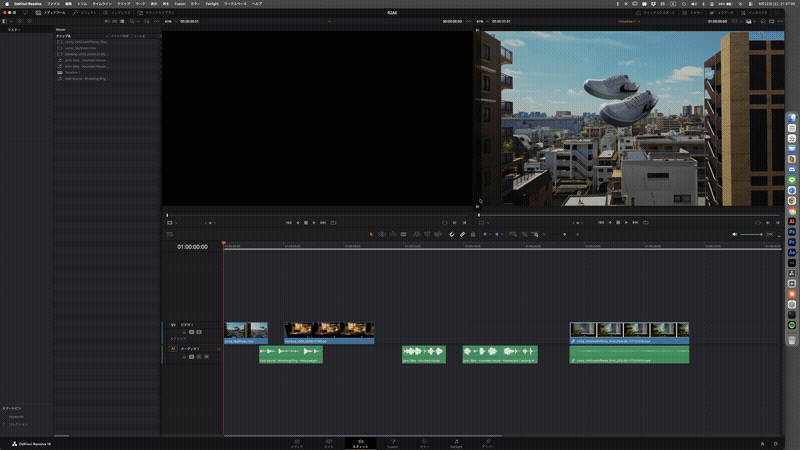

# R2AE

**[English README](README.md)**

DaVinci Resolve のタイムラインから After Effects へ、クリップの配置・スケール・位置・回転・アンカーポイント・速度・音声を再現した状態で送るブリッジスクリプトです。

Adobe Dynamic Link のような常時リンクではありません。実行するたびに現在のタイムライン状態を JSON に書き出し、After Effects 側で新しいコンポジションとして再構築する「使い切りの転送」です。転送後は Resolve と After Effects の間に依存関係は残らず、どちらを編集しても相手に影響しません。

**本ツールは時短のための補助スクリプトであり、EDL や AAF、XML のような正確性を保証するデータ交換フォーマットではありません。** スケールや位置、アンカーポイントなどの変換式は、公式仕様に基づくものではなく、Resolveのインスペクタ値とAfter Effects上の実際の見え方を突き合わせた実測ベースで導出しています。手作業の繰り返しを省くために作られたものであり、両ソフト間の完全かつ無損失な橋渡しを保証するものではありません。重要な用途で使う場合は、必ず元のタイムラインと結果を見比べて確認してください。



## できること

- タイムラインに設定した IN/OUT 範囲のクリップをまとめて送信（範囲をまたぐクリップは端で切り詰め）
- 複数トラック（映像・音声）を対象。トラック単位 / クリップ単位の有効・無効を反映
- コンポジションの解像度をタイムライン設定に一致させる
- クリップごとの Zoom・Pan/Tilt・Rotation・Anchor Point・Flip・Opacity を Scale / Position / Rotation / Anchor Point / Opacity に変換
- 定速リタイム（速度変更）をタイムリマップで再現。フレームレート変換との誤検出を避ける判定つき
- ステレオ音声が L/R の2トラックに分かれている場合の重複統合
- 映像クリップにリンクした音声トラックの二重再生防止
- 同一素材の再利用（同じファイルを何度も送っても Project パネルに重複作成しない）

## できないこと

- リアルタイムの同期（Dynamic Link のような常時リンクではありません）
- トランジション、キーフレームアニメーション、スピードランプ（可変速）
- カラーグレーディング、Resolve 側エフェクト、クロップ、複合クリップ、Fusion クリップ、タイトル
- ピッチ / ヨー（3D方向の傾き）は投影モデルの違いにより非対応

## 動作環境

- DaVinci Resolve（無償版 / Studio 版いずれも可。Lua スクリプティングが有効であること）
- Adobe After Effects（2024 以降推奨）
- macOS または Windows

検証は macOS + DaVinci Resolve + After Effects 2026 の組み合わせで行っています。

**OSによってAEへの送信方式が異なります。**

- **macOS**: AppleScript経由でAEに直接スクリプト実行を指示します。常駐や追加設定は不要で、`r2ae`を実行するだけで自動的に完結します。
- **Windows**: 起動中のAfter Effectsプロセスを検出し、`AfterFX.exe -r`で直接スクリプトを実行させます。**あらかじめAfter Effectsを起動しておく必要があります**（未起動の場合は自動起動せず、その旨がResolveのコンソールに表示されます。JSONは書き出し済みなので、後からAEを起動して再実行すれば送れます）。複数バージョンのAEがインストールされている場合、実際に**起動しているバージョン**にクリップが送られます。

## インストール

### 1. r2ae_receive.jsx の配置

```
macOS   : ~/Documents/ae_bridge/r2ae_receive.jsx
Windows : %USERPROFILE%\Documents\ae_bridge\r2ae_receive.jsx
```

`ae_bridge` フォルダが無ければ作成してください。

### 2. r2ae.lua の配置

```
macOS   : ~/Library/Application Support/Blackmagic Design/DaVinci Resolve/Fusion/Scripts/Utility/r2ae.lua
Windows : %APPDATA%\Blackmagic Design\DaVinci Resolve\Support\Fusion\Scripts\Utility\r2ae.lua
```

配置後、**DaVinci Resolve を完全に再起動**してください。スクリプトフォルダは起動時に一度だけ読み込まれます。

### 3. After Effects側の設定

環境設定 > スクリプトとエクスプレッション > 「スクリプトによるファイルへの書き込みとネットワークへのアクセスを許可」を ON にしてください。OFF のままだと JSON の読み込みでエラーになります。

### 4.（任意）r2ae_debug.lua

Resolve が返す値を確認したいときのための調査用スクリプトです。同じ Utility フォルダに置くとメニューに追加されます。動作に必須ではありません。

## 使い方

**Windowsの場合、事前に After Effects を起動しておいてください。** 未起動のままだとResolveから自動では起動できません（詳細は下記）。

1. Resolve のタイムラインで、送りたい範囲を `I` / `O` キーで IN/OUT 指定する
2. Workspace > Scripts > Utility > `r2ae` を実行

**macOS**: After Effects が起動 / 前面化し、新しいコンポジションが自動生成されます。

**Windows**: JSONが書き出された後、起動中のAfter Effectsへ`AfterFX.exe -r`で直接スクリプトを実行させます。**After Effectsを先に起動しておいてください**。未起動の場合はコンソールにその旨が表示され、JSONは書き出し済みのままになります。うまく実行されない場合は、AEのファイル > スクリプト > スクリプトファイルを実行から`r2ae_receive.jsx`を手動で開いてください。

IN/OUT 範囲に重なる全トラックのクリップが対象になります。範囲をまたぐクリップは端で切り詰められ、コンポジションの尺は指定した範囲と一致します。IN/OUT が設定されていない場合は何も送信されません。

## 設定項目

`r2ae.lua` 冒頭の変数で挙動を変更できます。

| 変数 | 説明 |
|---|---|
| `AUDIO_MODE` | `"auto"`（既定）/ `"video_only"` / `"separate"` — リンク音声の扱い |
| `INPUT_SCALING` | `"fit"`（既定）/ `"fill"` / `"stretch"` / `"none"` — Resolveのプロジェクト設定「解像度が一致しないファイル」に合わせる |
| `ROTATION_SIGN` | `1` / `-1`（既定）— 回転方向の補正 |
| `ENABLE_SPEED` | `true`（既定）— 速度変更をタイムリマップに反映するか |
| `RESPECT_TRACK_ENABLE` | `true`（既定）— 無効化したトラックを除外するか |
| `RESPECT_CLIP_ENABLE` | `true`（既定）— 無効化したクリップ（`D`キー）を除外するか |

## 仕組み

1. `r2ae.lua` が Resolve Scripting API 経由でタイムラインを読み、対象クリップのパス・トリム位置・Transform 値・速度をまとめて JSON に書き出す
2. **macOS**: `osascript` で After Effects に `r2ae_receive.jsx` の実行を直接指示する
3. **Windows**: `Get-Process` で起動中の`AfterFX.exe`の実パスを取得し、`AfterFX.exe -r`で`r2ae_receive.jsx`の実行を直接指示する（After Effectsが起動している必要がある。うまくいかない場合は手動実行で後から取り込める）
4. `r2ae_receive.jsx` が JSON を読み込み、素材をインポートしてコンポジションを構築する

以降、両ソフト間の接続は残りません。

## Transform 変換について

Resolve のインスペクタ値（Zoom / Pan / Tilt / Anchor Point / Rotation）は、タイムライン解像度・素材解像度・プロジェクトのスケーリング設定が絡み合った座標系を持っています。特に Anchor Point は単純な位置ではなく「ピボット」として扱われており、値を動かすと画面上の表示位置も一緒に動きます。このツールでは実測に基づいてこの変換式を導出しています（詳しくは `r2ae.lua` 内のコメントを参照）。

## 既知の制約

- Resolve Scripting API には「タイムライン上で選択中のクリップ」を取得する手段がありません。そのため範囲指定は IN/OUT で行います。特定のクリップだけを送りたい場合は、トラックやクリップの有効・無効と併用してください
- 素材 fps とタイムライン fps が異なる場合のコンフォームと、実際の速度変更の判定はヒューリスティックです。誤判定に気づいた場合は Issue で実測値（Resolve Console のログ）を添えて報告してください
- ピッチ / ヨーは Resolve と After Effects で投影モデルが異なるため、正確な再現ができず非対応としています
- Windowsの自動実行には、あらかじめAfter Effectsが起動している必要があります。未起動の場合は自動起動せず、コンソールにその旨が表示されます（JSONは書き出し済みなので、後からAEを起動して手動実行で取り込めます）

## ライセンス

MIT License. `LICENSE` を参照してください。

## 免責事項

本ツールは DaVinci Resolve および After Effects の公式ドキュメント記載のスクリプティング API のみを使用しています。両ソフトの内部実装や非公開 API には依存していませんが、将来のバージョンアップで API の挙動が変わった場合、動作しなくなる可能性があります。無保証で提供されます。重要なプロジェクトで使用する前に、必ずテスト環境で動作を確認してください。
